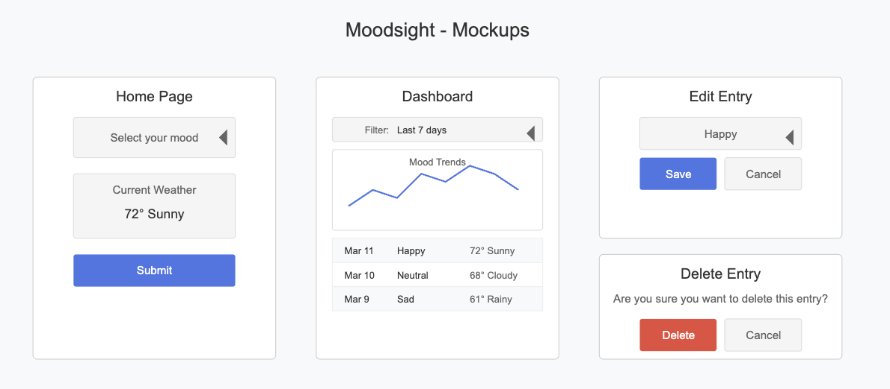

# Moodsight – A Minimalist Mood Tracker

## Overview

Moodsight is a web application that allows users to log their daily moods and track patterns over time. The app integrates with the OpenWeather API to fetch the weather conditions at the time of each entry. Users can view their past moods and trends, with options to filter by date ranges and edit past entries.

### Problem Space

Many people want to track their moods but find traditional journaling overwhelming. Moodsight provides a low-effort solution where users can quickly log their moods, view past trends, and see how weather conditions might correlate with their emotions.

### User Profile

People who prefer a quick, structured way to track moods without full journaling.

How will they use it?

1. Open the app and see a simple mood submission form.
2. Select a mood (Happy, Neutral, Sad, etc.), and the app automatically fetches the current weather.
3. Submit the mood entry.
4. View past moods on a dashboard, where they can see trends over time.[optional, could be a simple list]
5. Filter mood history by date range (e.g., last week, last month).[optiona]
6. Edit or delete past entries if needed.

### Features

1. Log Mood Entries: Users select a mood from a predefined set and submit it.
2. Weather API Integration: Automatically fetches weather conditions at the time of submission.
3. Mood History Dashboard: Displays past moods and weather correlations.
4. Edit & Delete Entries: Users can modify or remove past mood logs.
5. Filter by Date Range: Users can view mood history within specific periods (e.g., last 7 days, last month). [optiona]
6. Basic Data Visualization: Simple charts to show mood trends over time. [optional]

## Implementation

### Tech Stack

1. Frontend: React.js (for UI)
2. Backend: Express.js (Node.js server for handling API requests)
3. Database: SQL database (for storing mood logs)
4. Chart.js (for mood trend visualizations) [option]

### APIs

OpenWeather API → Fetches real-time weather data for mood entries. (https://openweathermap.org/api) 1,000 API calls per day for free

### Sitemap

 1. New Entry Page → Allows users to log a new mood. 
 2. Submission successful [optional]
 3. Dashboard Page → Lists past moods (with filtering options maybe)

### Mockups

Low fidelity Wireframes

### Data

1. id	
- SERIAL PRIMARY KEY	
- Unique identifier for each mood entry
2. date	
- DATE NOT NULL	
- The date of the mood entry
3. mood	
- VARCHAR(20) NOT NULL 
- Mood selected by user (e.g., Happy, Neutral, Sad)
4. temperature	
- FLOAT	
- Temperature at the time of entry
5. weather_condition	
- VARCHAR(50)	
- Description of the weather (e.g., Sunny, Cloudy)

Data Flow Example
1. User submits a mood entry.
2. Frontend calls OpenWeather API → Fetches real-time weather data.
3. Frontend sends data (mood + weather) to backend via a POST request.
4. Backend saves entry into the SQL database (logs table).
5. Dashboard fetches mood history using a GET request.
6. Users can update or delete entries through PUT or DELETE requests.

### Endpoints

List endpoints that your server will implement, including HTTP methods, parameters, and example responses.

## Roadmap

Scope your project as a sprint. Break down the tasks that will need to be completed and map out timeframes for implementation working back from the capstone due date.

---

## Future Implementations

Your project will be marked based on what you committed to in the above document. Here, you can list any additional features you may complete after the MVP of your application is built, or if you have extra time before the Capstone due date.
